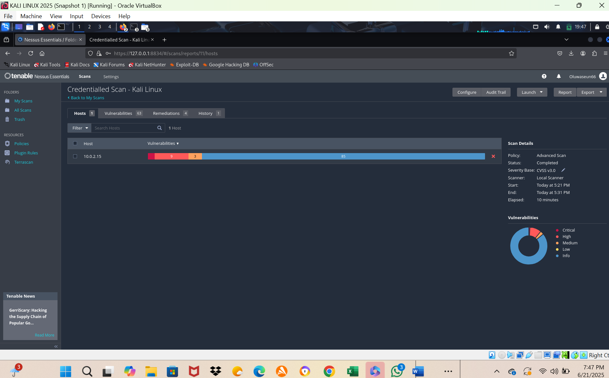
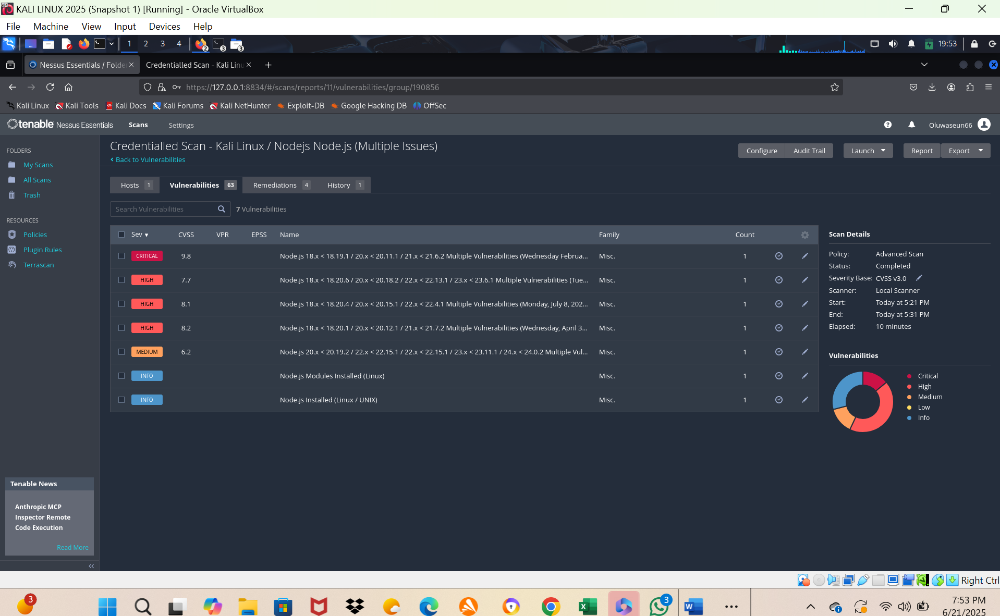
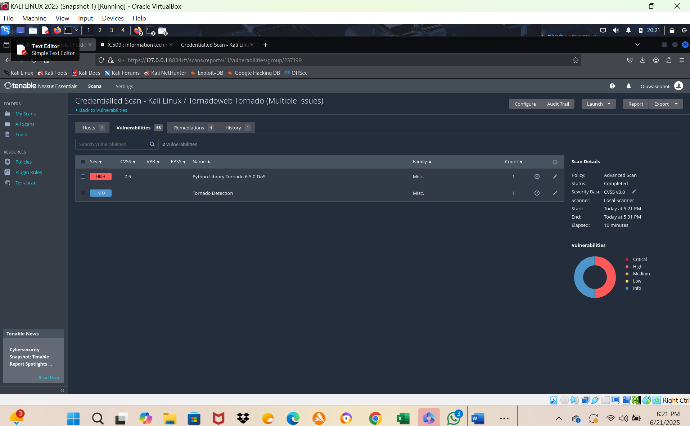
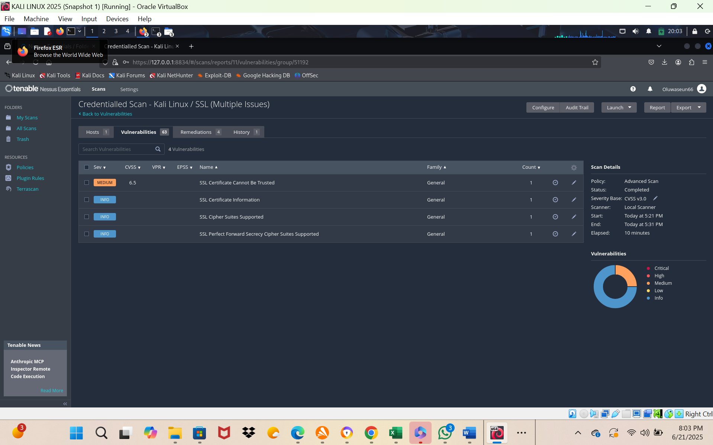

# Project 02 – Credentialed Vulnerability Assessment of a Kali Linux VM Using Nessus

## Overview

In this project, I document a **credentialed vulnerability assessment** of a Kali Linux virtual machine in my home lab using **Tenable Nessus Essentials**. By configuring SSH-based credentials, the scan was able to perform deeper checks on installed services and packages (Node.js, PostgreSQL, Python libraries, etc.), producing more accurate and actionable results than a non-credentialed scan.

The goal of this lab is to simulate a real-world internal vulnerability assessment, prioritize findings using CVSS, and propose concrete remediation steps.

---

## Lab Environment

- **Target OS:** Kali Linux (Kernel 6.12.25-amd64)  
- **Scanner:** Nessus Essentials v10.8.3  
- **Scan Type:** Credentialed SSH Scan  
- **Target IP:** `10.0.2.15`  
- **Network Setup:** Local VM network in a home lab

---

## Objectives

- Discover known vulnerabilities affecting installed packages and services.  
- Analyze vulnerability severity using **CVSS scores** and Nessus plugin data.  
- Propose realistic patching and configuration changes to reduce risk.  
- Demonstrate practical **vulnerability management skills** in a lab setting.  

---

## Scan Summary

The credentialed scan completed successfully and identified multiple **critical, high, and medium** vulnerabilities across:

- **Node.js runtime**
- **PostgreSQL database**
- **Tornado web framework**
- **SSL / certificate configuration**
- Miscellaneous Linux packages and libraries
- Overall Scan Dashboard
- 

All findings were captured in the exported **Nessus HTML/PDF report** (see `Files/` folder) and summarized visually in screenshots (see `Screenshots/` folder).

---

## Key Vulnerabilities Identified

### 1. Node.js – Critical & High Findings
- 

- **CVE-2024-21892 – Critical**  
  Privilege escalation vulnerability in Node.js that could allow an attacker with limited access to escalate privileges and execute arbitrary code.

- **CVE-2024-27980 – High**  
  Command injection via batch handling in Node.js, potentially allowing remote code execution if an attacker can control input to affected components.

### 2. PostgreSQL – High & Medium Findings
- 
- **CVE-2023-5869 – High**  
  Memory overflow issue in PostgreSQL, potentially leading to denial of service or unexpected behavior.

- **CVE-2024-4317 – Medium**  
  Information disclosure through extended statistics, potentially exposing internal details about database objects or query behavior.

### 3. Other Notable Issues

- **Tornado Web Framework**
-  
  Outdated version impacted by known vulnerabilities in request handling and async operations.

- **SSL / Certificates**
- 
  Use of **self-signed SSL certificates**, which can be abused for man-in-the-middle attacks and do not provide proper trust validation.

---

## Recommended Remediation

**Node.js**

- Upgrade Node.js to **v20.19.2 or later**, ensuring all security patches related to CVE-2024-21892 and CVE-2024-27980 are applied.
- Review any applications or services using Node.js to confirm compatibility with the new version.

**PostgreSQL**

- Update PostgreSQL to **version 16.7 or higher**.  
- Restart affected services and validate that database applications work correctly post-upgrade.

**Tornado Web Framework**

- Upgrade Tornado to **v6.5.0** or later.  
- Run application regression tests to ensure no breaking changes.

**SSL / Certificates**
- Replace self-signed certificates with **trusted CA-signed certificates**.  
- Harden TLS configuration (protocols and ciphers) and enable strong certificate validation.

---

## Skills Demonstrated

- Secure configuration of **credentialed Nessus scans** using SSH keys/passwords.  
- Interpretation of **CVSS scores**, Nessus plugin output, and risk ratings.  
- **CVE research** and mapping vulnerabilities to specific software versions.  
- Creation of **remediation plans** aligned with patching and configuration best practices.  
- Familiarity with **Linux file systems**, service management, and basic system hardening.  
- Clear documentation and presentation of findings for stakeholder review.

---

## Repository Structure

```text
Project-02-Nessus-VM-Vulnerability-Assessment/
├── README.md                  # This file – full project write-up
├── Screenshots/               # Nessus UI and vulnerability details
│   ├── nessus-dashboard.png
│   ├── critical-nodejs-vuln.png
│   ├── postgres-high-vuln.png
│   └── ...
└── Files/
    └── Nessus-Vulnerability-Report.pdf   # Exported Nessus report

