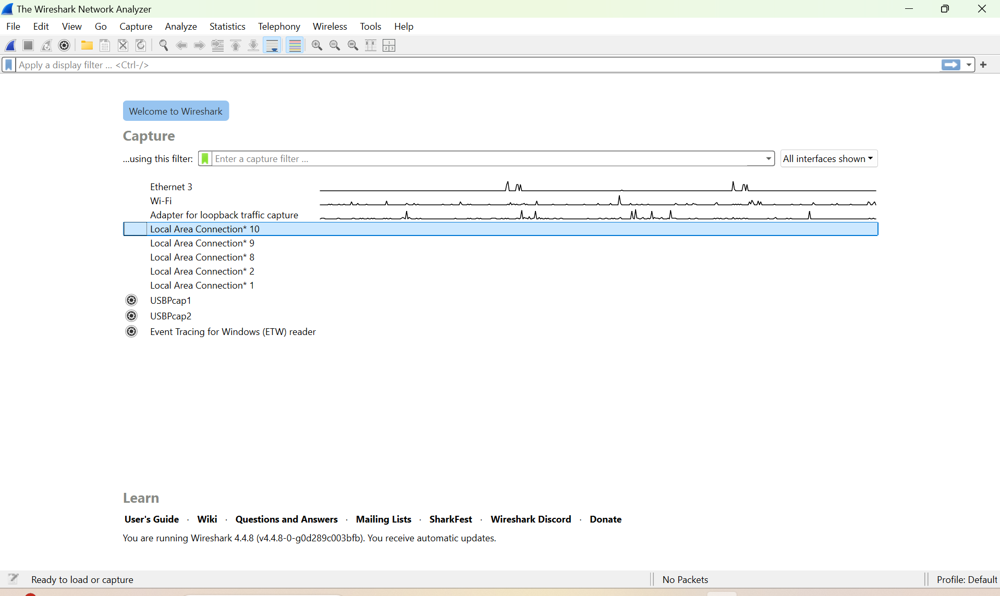
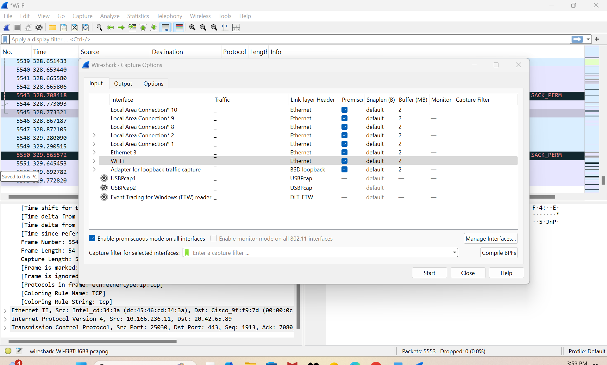

# Project 02 – Wireshark Lab: HTTP Traffic Capture & Analysis

## Overview
This project demonstrates hands-on packet capture and protocol analysis using **Wireshark**.  
By generating real HTTP traffic and examining packets at the Ethernet, IP, TCP, and HTTP layers, this lab provides a practical understanding of how data moves across a network and how protocol interactions occur behind the scenes.

The lab focuses on:
- Identifying protocols in captured traffic  
- Filtering packets using Wireshark display filters  
- Capturing HTTP GET and OK responses  
- Measuring HTTP response time  
- Extracting IP addresses, ports, and browser metadata  

_All analysis and screenshots were performed on a Windows 10 system using Wi-Fi as the capture interface._

---

## Lab Environment
- **Operating System:** Windows 10  
- **Tool:** Wireshark (latest version)  
- **Interface Used:** Wi-Fi  
- **Website Accessed:** `http://gaia.cs.umass.edu/wireshark-labs/INTRO-wireshark-file1.html`  
- **Packet Type Captured:** DNS, TCP, TLSv1.2, HTTP  

---

## Objectives
1. Install and run Wireshark  
2. Capture live network packets  
3. Filter for HTTP traffic  
4. Analyze GET and OK response packets  
5. Locate protocol information and browser metadata  
6. Measure HTTP round-trip response time  
7. Extract IP addresses and port numbers  

---

## Implementation & Screenshots

### **1. Wireshark Startup Interface**
Shows available network interfaces.  

`Screenshots/wireshark-startup.png`

### **2. Interface Selection**
Wi-Fi selected for capturing packets.  

`Screenshots/wireshark-interfaces.png`

### **3. Capturing Live Packets**
Capture begins and packets appear in real time.  

`Screenshots/wireshark-live-capture.png`

### **4. Capturing HTTP Messages**
HTTP GET and OK response captured.  
 
`Screenshots/http-get-ok.png`

### **5. Applying HTTP Filters**
Filtered by typing `http` in the display filter bar.  
📌 *Screenshot required:*  
`Screenshots/http-filter.png`

### **6. HTTP GET Request Details**
Expanded HTTP layer showing GET request.  
📌 *Screenshot required:*  
`Screenshots/http-get-details.png`

### **7. Measuring Response Time**
GET timestamp and OK timestamp used to calculate latency.  
Example from the lab report:  
`0.029683 seconds`  
📌 *Screenshot required:*  
`Screenshots/http-time-calc.png`

---

## Key Findings

### **1. Protocols Observed**
From the Protocol column:  
- DNS  
- TCP  
- TLSv1.2  
- HTTP

### **2. HTTP Response Time Measured**
Time between GET request and HTTP OK reply:  
**0.029683 seconds**

### **3. Identified IP Addresses**
From packet details:  
- **Server:** `128.119.245.12`  
- **Client:** `10.166.236.11`

### **4. Browser Used**
From User-Agent field:  
**Microsoft Edge**

### **5. Destination Port**
HTTP traffic sent to:  
**Port 80 (HTTP)**

---

## Skills Demonstrated
- Network packet analysis  
- Use of Wireshark filters  
- HTTP protocol inspection  
- Latency measurement  
- Layer-by-layer traffic analysis (Ethernet → IP → TCP → HTTP)  
- Extracting technical metadata from packet headers  
- Documenting findings clearly  

---

## Repository Structure
Project-02-Wireshark-HTTP-Analysis/
├── README.md
├── Screenshots/
│ ├── wireshark-startup.png
│ ├── wireshark-interfaces.png
│ ├── wireshark-live-capture.png
│ ├── http-get-ok.png
│ ├── http-filter.png
│ ├── http-get-details.png
│ └── http-time-calc.png
└── Files/
└── Project-02-Wireshark-Report.pdf

---

## Files Included
- **PDF:** Original lab report (`Files/Project-02-Wireshark-Report.pdf`)  
- **Screenshots:** Extracted from lab implementation for visual explanation  
- **README:** Professional write-up summarizing the project

---

## Conclusion
This Wireshark lab provided in-depth experience with packet capture and protocol analysis.  
By examining HTTP traffic at multiple layers, we strengthened our understanding of how web requests travel across the network and how Wireshark can be used to troubleshoot, analyze, and validate network behavior.

This project forms part of my broader cybersecurity learning portfolio covering SOC, GRC, network forensics, and vulnerability analysis.
