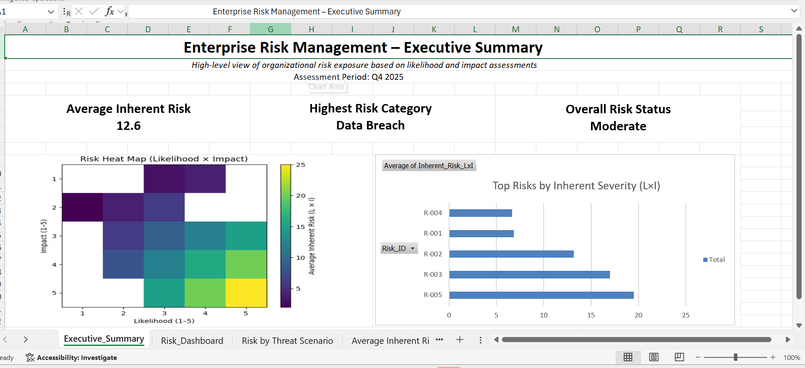
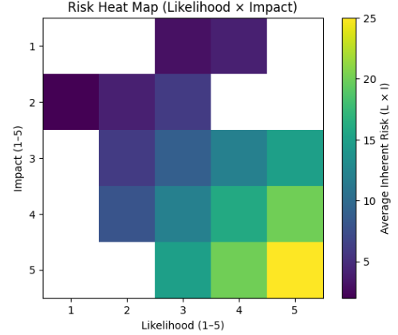
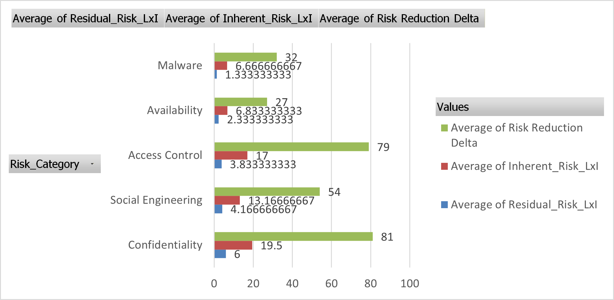
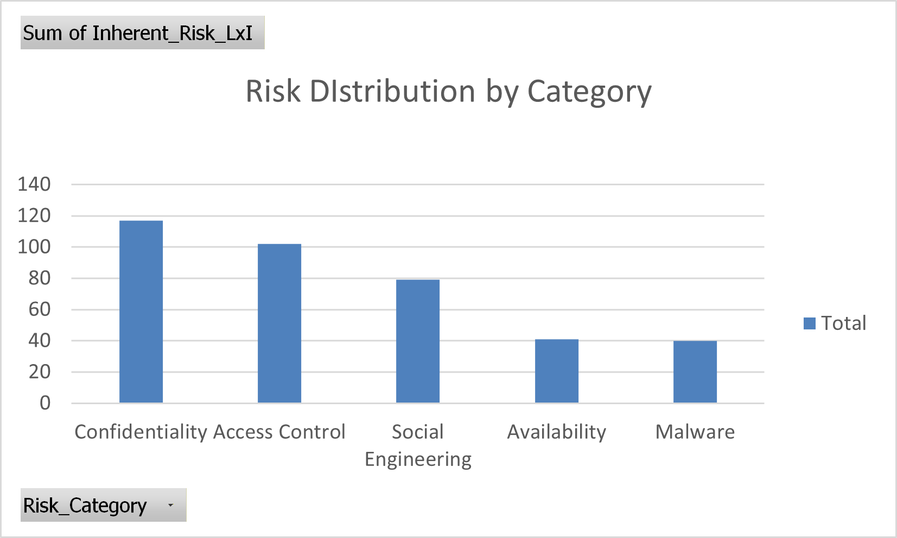

# GRC Risk Management Dashboard

## Overview
This project presents an **enterprise-style risk management dashboard** designed to support
Governance, Risk, and Compliance (GRC) decision-making.

The dashboard consolidates risk data into **executive-level insights**, enabling leadership to
quickly understand the organization’s risk posture, prioritize high-severity risks, and evaluate
the effectiveness of implemented controls.

The project mirrors how **risk analysts and GRC teams** deliver dashboards in real organizations,
balancing executive visibility with analytical depth and auditability.

---

## Executive Summary

The Executive Summary provides a **high-level snapshot** of the organization’s risk posture,
highlighting:
- Overall risk exposure
- Distribution of high, medium, and low risks
- Residual risk after controls are applied
- Priority focus areas for risk treatment

📌 The Executive Summary is:
- The **first tab** inside the Excel dashboard
- Exported as a **PDF** for executive sharing

➡️ **Download:** `Files/Executive_Summary.pdf`

---

## Key Dashboard Visualizations

### Risk Heat Map (Likelihood × Impact)

This heat map visualizes inherent risk severity by plotting likelihood against impact, allowing
stakeholders to immediately identify **high-risk concentrations** that require urgent attention.

---

### Inherent vs Residual Risk

This chart compares risk exposure **before and after control implementation**, demonstrating
how mitigation strategies reduce overall risk levels.

---

### Risk by Category

This visualization presents risk exposure grouped by **risk domain**, including
Confidentiality, Access Control, Availability, Malware, and Social Engineering.

By aggregating inherent risk scores across these categories, the chart helps
leadership identify **which risk domains contribute most to overall enterprise
risk** and where mitigation or control improvements should be prioritized.
---

## Dashboard File
- **Location:** `Dashboard/Risk_Dashboard.xlsx`
- Opens directly to the **Executive Summary tab**
- Includes supporting pivot tables and raw data (hidden for executive view)

---

## Data & Auditability
- **Raw risk data:** `Data/Raw_Risk_Data.xlsx`
- **Supporting pivot tables:** `Data/Pivot_Tables.xlsx`

These files ensure transparency, traceability, and reproducibility of all dashboard metrics.

---

## Methodology & Analysis
- **Risk Scoring Framework:** `Docs/Risk_Methodology.md`
- **Control Impact Review:** `Docs/Control_Effectiveness_Analysis.md`

---

## Skills Demonstrated
- GRC risk assessment & prioritization
- Risk scoring (likelihood × impact)
- Executive dashboard design
- Control effectiveness evaluation
- Excel dashboards & pivot table modeling
- Risk communication for technical and non-technical audiences
