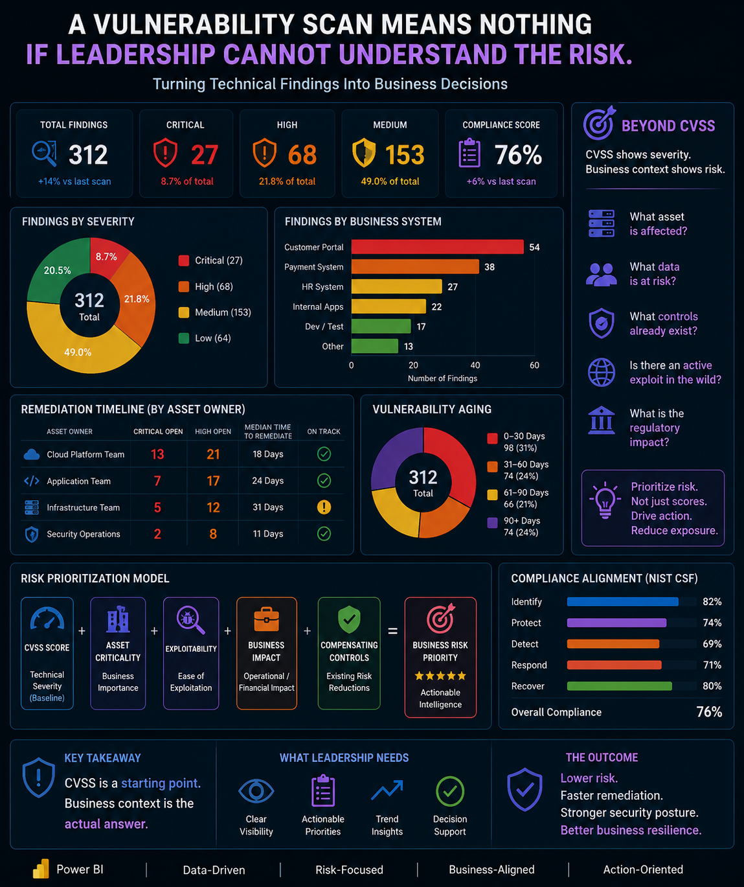

# Vulnerability Risk Dashboard
### Turning Technical Findings Into Business Decisions

---

A vulnerability scan returned 312 findings. My first instinct was to sort by CVSS score and start from the top.

That instinct was wrong.

CVSS tells you how severe a vulnerability is in isolation. It does not tell you whether the affected system holds customer payment data. It does not tell you whether a compensating control already limits exposure. It does not tell you whether an active exploit exists in the wild for that specific version.

This project documents how I reframed raw vulnerability data into a business risk dashboard built for leadership decision-making — not just technical triage. It sits at the intersection of vulnerability management, cyber risk reporting, and Technical GRC.

---

## The Problem

A mock vulnerability assessment returned the following:

| Metric | Value |
|---|---|
| Total Findings | 312 |
| Critical | 27 (8.7%) |
| High | 68 (21.8%) |
| Medium | 153 (49.0%) |
| Overall Compliance Score | 76% |

The raw numbers answer one question: how many vulnerabilities exist?

Leadership is not asking that question. They are asking:

- Which findings threaten critical business systems?
- Which teams are responsible for remediation and are they on track?
- Which vulnerabilities have been sitting open for 90 days and why?
- Where is our compliance posture weakest and what does that mean for the business?

This dashboard was built to answer those questions.

---

## The Core Insight

> CVSS is a starting point. Business context is the actual answer.

A Medium-severity finding on a public-facing authentication system with no MFA and direct access to sensitive records is a more urgent conversation than a Critical finding sitting behind three layers of network segmentation on a non-production server.

The risk prioritization model used in this dashboard reflects that reality by combining:

- CVSS score (technical baseline)
- Asset criticality (business importance)
- Exploitability (ease of exploitation)
- Business impact (operational and financial exposure)
- Compensating controls (existing risk reductions)

The output is Business Risk Priority — actionable intelligence, not a sorted list.

---

## Dashboard Preview



---

## Dashboard Components

### Executive Risk Summary
The top panel gives leadership immediate visibility into total findings, severity distribution, compliance score, and trend direction compared to the previous scan. The compliance score increased 6% from the last scan. Total findings increased 14%. Both numbers matter and neither one tells the full story alone.

### Findings by Business System
Mapping vulnerabilities to business systems rather than IP addresses changes the conversation entirely. The Customer Portal carried 54 findings. The Payment System carried 38. Those are not technical problems. They are business risk conversations that involve data sensitivity, regulatory exposure, and customer trust.

### Remediation Timeline by Asset Owner
Accountability matters as much as severity. This panel tracks critical and high findings by team, median time to remediate, and whether each team is on track. The Infrastructure Team median remediation time was 31 days — flagged as behind. The Cloud Platform Team had 13 critical findings open. These are the numbers that belong in a leadership meeting, not buried in a spreadsheet.

### Vulnerability Aging
74 findings had been open for 90 days or more. That is not a technical backlog. That is a governance failure. Aging metrics surface where remediation accountability has broken down and where risk is quietly accumulating beyond acceptable thresholds.

### NIST CSF Alignment
The dashboard maps findings against the five NIST Cybersecurity Framework functions:

| Function | Alignment |
|---|---|
| Identify | 82% |
| Recover | 80% |
| Protect | 74% |
| Respond | 71% |
| Detect | 69% |

Detect was the weakest function at 69%. Identify was the strongest at 82%. That gap is exactly where a GRC professional needs to focus the conversation — not on raw finding counts, but on where the organization's security program has structural weaknesses.

### Beyond CVSS
The dashboard includes a prioritization reference panel that frames every finding through five business-context questions:

- What asset is affected?
- What data is at risk?
- What controls already exist?
- Is there an active exploit in the wild?
- What is the regulatory impact?

These questions do not appear in a CVSS score. They appear in a governance conversation.

---

## Technical GRC Value

This project demonstrates what Technical GRC looks like in practice. A GRC professional working at this level is not just documenting controls or tracking compliance percentages. They are:

- Reading vulnerability data and understanding what it means operationally
- Mapping technical findings to business systems and risk exposure
- Connecting remediation accountability to governance expectations
- Identifying framework gaps and framing them for leadership
- Building visibility tools that support real decisions

The dashboard is not the deliverable. The decision-making clarity it creates is the deliverable.

---

## Tools and Skills

- Power BI (dashboard design and data visualization)
- Vulnerability management concepts and CVSS scoring
- Risk prioritization modeling
- NIST Cybersecurity Framework alignment
- Technical GRC and cyber risk reporting
- Executive risk communication

---

## Repository Structure

```
vulnerability-risk-dashboard/
│
├── README.md
├── assets/
│   └── vulnerability-risk-dashboard.png
└── project-notes.md
```

---

## Planned Enhancements

- Sample vulnerability dataset (anonymized CSV) for full reproducibility
- Power BI `.pbix` file with DAX measures for dynamic risk scoring
- Automated risk prioritization formula with weighted scoring model
- Expanded NIST 800-53 and ISO 27001 control mapping
- Board-level executive summary page
- Threat intelligence integration for active exploit flagging

---

## About This Project

This is part of a broader portfolio focused on Technical GRC, building a hybrid profile that connects cybersecurity operations to business governance. Each project in this portfolio is designed to show that security work is not complete until it reaches the people who make decisions about risk.

> If leadership cannot understand the risk, the scan means nothing.
